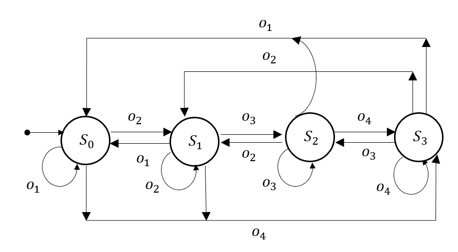
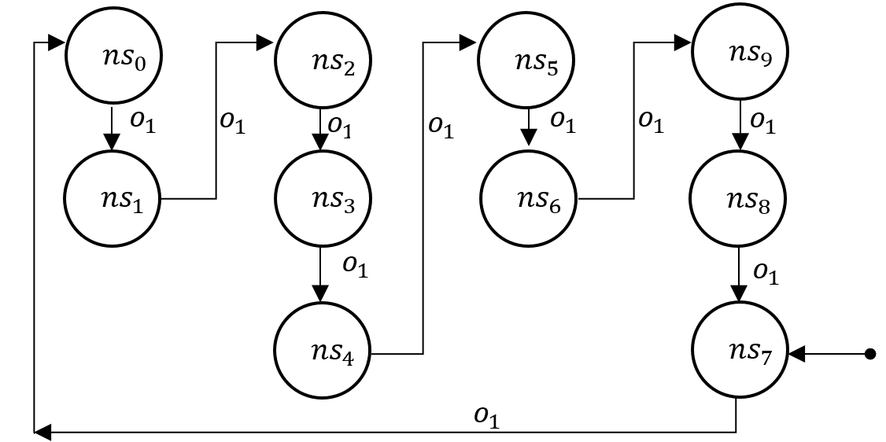
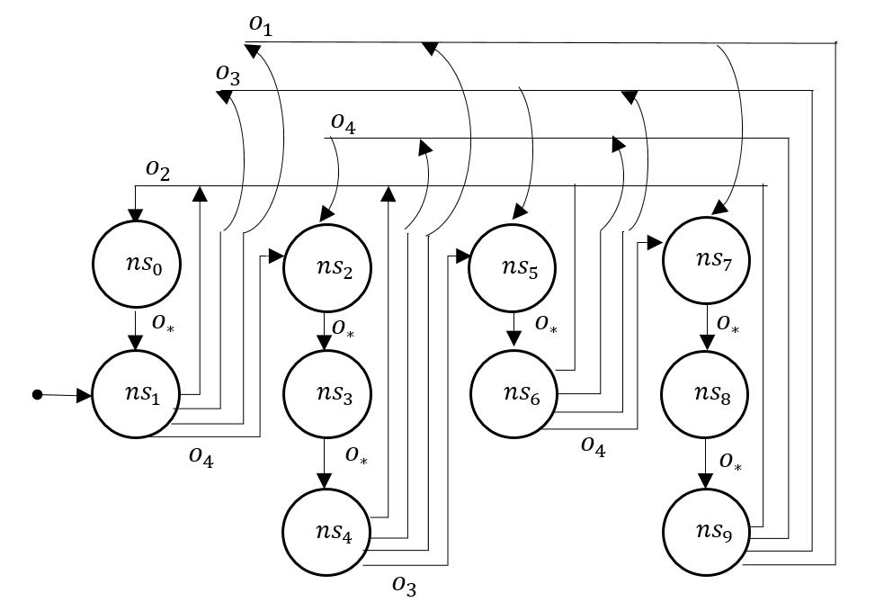

# Results

Visual representation of Extracted Moore Machines for ```gru_size=5 , bhx_size=20 and ox_size=8```

* GoldRushRead-v0
        <p align="center">
            
        </p>

    * Binary representation of extracted un-minified observation/hidden-state space could be found [here](GoldRushRead-v0/gru_5_hx_(20,8)_bgru/fsm.txt)
    * Minified observation/hidden-state could be found  [here](GoldRushRead-v0/gru_5_hx_(20,8)_bgru/minimized_fsm.txt)

* GoldRushBlind-v0
        <p align="center">
            
        </p>

    * Binary representation of extracted un-minified observation/hidden-state space could be found [here](GoldRushBlind-v0/gru_5_hx_(20,8)_bgru/fsm.txt)
    * Minified observation/hidden-state could be found  [here](GoldRushBlind-v0/gru_5_hx_(20,8)_bgru/minimized_fsm.txt)
    * Note : during minimization all the observations are clubbed together as they don't play any role in decision making

* GoldRushSneak-v0
        <p align="center">
            
        </p>
    * Binary representation of extracted un-minified observation/hidden-state space could be found [here](GoldRushSneak-v0/gru_5_hx_(20,8)_bgru/fsm.txt)
    * Minified observation/hidden-state could be found  [here](GoldRushSneak-v0/gru_5_hx_(20,8)_bgru/minimized_fsm.txt)
    * Note : during clock counters; the transaction behaviour is valid for all observations <i>o<sub>*</sub>